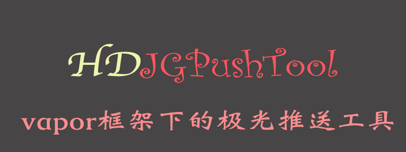

# HDJGPushTool

`JiGuang Push` is an independent third-party cloud push platform in China, which can quickly integrate the message push function of Android and iOS platforms. There may not be many users in other countries. If you need English instructions, you can submit an issue.

`vapor`是一个`swift`语言开发的服务器框架，该项目是在`vapor`框架下集成使用极光推送的库。

使用`swift`语言开发，基于`极光推送`官网的`Rest Api`接口，三行代码即可快速集成服务器端功能。

## 一、项目集成

可以采用SPM方式添加，也可以采用源文件方式添加

### 1.1、SPM方式集成

在`Vapor`项目的`Package`文件中，在`dependencies`添加依赖

```
.package(url: "https://github.com/DamonHu/vapor-HDJGPushTool.git", from: "1.1.8"),
```

在`targets`中添加

```
.target(name: "App", dependencies: ["Vapor", "HDJGPushTool"]),
```
### 1.2、源文件方式添加

将本git仓库里面的`Sources`目录下的`HDJGPushTool`整个文件夹拖入添加到工程即可

## 二、快速使用

```
//1、导入通知类
import HDJGPushTool
//2、创建通知对象, 记得把JiguangAppkey和JiguangSecret替换为你自己应用的appkey和secret
let pushTool = HDJGPushTool(appKey: JiguangAppkey, appSecrect: JiguangSecret)
//3、创建通知内容
let pushModel = HDJGPushModel(alertTitle: "通知的标题", alertContent: "通知的内容")
//4、发送通知
try pushTool.pushNotification(req, pushModel: pushModel)
```

示例：

```
router.post("notice/callback", String.parameter) { (req) -> String in
        let webName = try req.parameters.next(String.self)
        //发送通知
        let pushTool = HDJGPushTool(appKey: Lazypig_jiguangAppkey, appSecrect: Lazypig_jiguangSecret)
        let pushModel = HDJGPushModel(alertTitle: "网站回调了", alertContent: "有网站请求回调")
        try pushTool.pushNotification(req, pushModel: pushModel)
        return "回调成功"
}
```

## 三、更多配置

可以通过设置`pushModel`实现更多操作，推送的目标，可以参考极光的文档设置: [极光推送官方文档](https://docs.jiguang.cn/jpush/server/push/rest_api_v3_push/#audience)

```
let pushModel = HDJGPushModel(alertTitle: "通知的标题", alertContent: "通知的内容")
//推送到测试环境
pushModel.apnsProduction = fasle
//单独推送的平台
pushModel.platform = .ios
//推送的目标，可通过registrationId、tag、tagAnd、tagNot、alias等创建audience设置专门的推送目标，如果设置为null则为推送给全部用户
pushModel.audience = HDJGPushAudienceModel(registrationId: AdminPushList)
```

直接使用极光的api会更灵活，你可以进行参考或者扩充以便更加方便使用